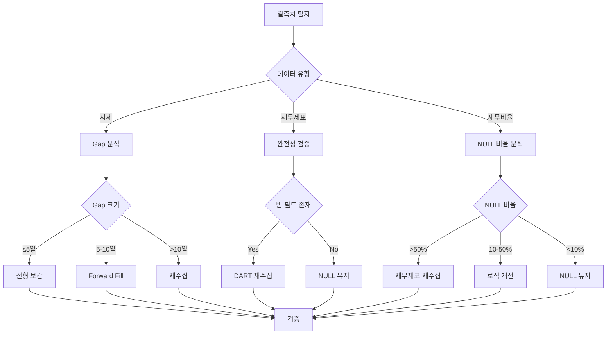

# 재무 데이터 결측치 처리 전략

**작성일**: 2025-10-23
**버전**: 1.0
**작성자**: Stock Portfolio System

## 📋 목차

1. [개요](#개요)
2. [시세 데이터 결측치 처리](#시세-데이터-결측치-처리)
3. [재무제표 결측치 처리](#재무제표-결측치-처리)
4. [재무비율 결측치 처리](#재무비율-결측치-처리)
5. [구현 가이드](#구현-가이드)
6. [검증 방법](#검증-방법)

---

## 개요

### 결측치 발생 원인

1. **시세 데이터**
   - 거래소 휴장일 (공휴일, 명절)
   - 거래 정지 (불성실공시, 관리종목 지정)
   - 데이터 수집 오류

2. **재무제표**
   - 미공시 기업 (상장 예정, 상장 폐지)
   - 회계감사 지연
   - DART API 수집 오류
   - 빈 JSONB 필드 (제출되었으나 데이터 없음)

3. **재무비율**
   - 재무제표 미존재 → 계산 불가
   - 재무제표 불완전 → 일부 비율만 계산 가능
   - 전기 데이터 부족 → 증가율 계산 불가

### 처리 원칙

| 데이터 유형 | 결측치 처리 방법 | 근거 |
|------------|----------------|------|
| **시세 데이터** | 보간 (Interpolation) | 시계열 연속성 보장 |
| **재무제표** | NULL 유지 (재수집 권장) | 추정 불가능한 회계 데이터 |
| **재무비율** | NULL 유지 또는 조건부 계산 | 재무제표 존재 시에만 계산 |

---

## 시세 데이터 결측치 처리

### 1. 결측치 유형 분류

#### 1.1 단기 결측 (Gap ≤ 5일)
**원인**: 연휴, 공휴일, 단기 거래 정지

**처리 방법**: **선형 보간 (Linear Interpolation)**

```python
# 선형 보간 공식
price(t) = price(t-1) + (price(t+1) - price(t-1)) * (t - t-1) / (t+1 - t-1)
```

**적용 필드**:
- OHLC (Open, High, Low, Close)
- Volume (거래량)

**장점**:
- 자연스러운 가격 흐름 유지
- 급격한 가격 변동 방지

**예시**:
```
날짜       시가    고가    저가    종가    거래량
2024-01-29  70,000  71,000  69,500  70,500  10,000,000
2024-01-30  (결측)
2024-01-31  (결측)
2024-02-01  72,000  73,000  71,500  72,500  12,000,000

→ 선형 보간 후:
2024-01-30  70,667  71,667  70,167  71,167  10,666,667
2024-01-31  71,333  72,333  70,833  71,833  11,333,333
```

#### 1.2 중기 결측 (5일 < Gap ≤ 10일)
**원인**: 연휴 + 거래 정지, 장기 공휴일

**처리 방법**: **Forward Fill (LOCF - Last Observation Carried Forward)**

```python
# Forward fill
price(t) = price(t-1)  # 이전 값 그대로 사용
volume(t) = 0          # 거래량은 0
```

**적용 필드**:
- OHLC: 이전 종가 사용
- Volume: 0으로 설정 (거래 없음 명시)

**장점**:
- 급격한 가격 변동 방지
- 거래 정지 상태 명확히 표현

**예시**:
```
날짜       시가    고가    저가    종가    거래량
2024-02-05  70,000  71,000  69,500  70,500  10,000,000
... (7일 결측)
2024-02-13  72,000  73,000  71,500  72,500  12,000,000

→ Forward fill 후:
2024-02-06  70,500  70,500  70,500  70,500  0
2024-02-07  70,500  70,500  70,500  70,500  0
... (모두 70,500으로 채움)
2024-02-12  70,500  70,500  70,500  70,500  0
```

#### 1.3 장기 결측 (Gap > 10일)
**원인**: 관리종목 지정, 상장 폐지 예정, 데이터 수집 실패

**처리 방법**: **재수집 권장 (보간 금지)**

**근거**:
- 장기간 거래 정지는 중요한 정보 (투자 의사결정에 영향)
- 보간 시 실제 시장 상황 왜곡 가능

**처리**:
1. 재수집 시도 (`pykrx` 재실행)
2. 재수집 실패 시: NULL 유지 (분석 제외)

### 2. 구현 스크립트

**파일**: `scripts/missing_data/interpolate_prices.py`

**주요 기능**:
- `find_gaps()`: 시세 데이터 gap 탐지
- `linear_interpolate()`: 선형 보간
- `forward_fill()`: forward fill
- `interpolate_all_stocks()`: 전체 종목 일괄 처리

**사용 예시**:

```bash
# 단일 종목 보간 (삼성전자, 선형 보간, gap ≥ 5일)
python scripts/missing_data/interpolate_prices.py \
    --ticker 005930 \
    --method linear \
    --min-gap 5

# 전체 종목 보간 (forward fill, gap ≥ 2일, dry-run)
python scripts/missing_data/interpolate_prices.py \
    --all-stocks \
    --method ffill \
    --min-gap 2 \
    --dry-run
```

### 3. 검증 기준

| 항목 | 목표 | 검증 방법 |
|------|------|----------|
| 보간 성공률 | ≥ 90% | `gaps_filled / gaps_found` |
| OHLC 관계 유지 | 100% | High ≥ Open/Close/Low |
| 거래량 음수 방지 | 100% | Volume ≥ 0 |

---

## 재무제표 결측치 처리

### 1. 결측치 유형 분류

#### 1.1 종목 레벨 결측 (재무제표 전체 없음)
**원인**:
- 미상장 기업 (IPO 준비 중)
- 상장 폐지 완료
- 재무제표 미제출 기업 (벤처기업 등)

**처리 방법**: **NULL 유지 + 재수집**

```bash
# DART API 재수집
python scripts/collect_financial_statements.py \
    --ticker {ticker} \
    --years 2024 2023 2022
```

**분석 제외 조건**:
- 재무제표가 없는 종목은 재무비율 분석 제외
- 시세 데이터만 사용한 기술적 분석은 가능

#### 1.2 분기 레벨 결측 (특정 분기만 없음)
**원인**:
- 회계감사 지연 (연간 재무제표 늦게 제출)
- 분기 보고 누락

**처리 방법**: **NULL 유지 (이전 분기 값 사용 금지)**

**근거**:
- 재무제표는 추정 불가능한 회계 데이터
- 이전 분기 값 사용 시 분석 왜곡
- 예: 2024Q2 실적이 없는데 2024Q1 실적으로 대체 → 잘못된 증가율 계산

**권장**:
- 결측 분기는 분석 제외
- 연간 재무제표 대기 후 재계산

#### 1.3 필드 레벨 결측 (JSONB 내부 빈 값)
**원인**:
- DART API 응답에 데이터 없음
- 회계항목 미존재 (예: 영업외수익 없음)

**처리 방법**: **필드별 NULL 처리**

**구분**:

| 필드 | NULL 의미 | 처리 |
|------|----------|------|
| `balance_sheet = {}` | 재무상태표 전체 없음 | 재수집 |
| `balance_sheet.assets.current.cash = null` | 현금 항목 없음 | 0으로 간주 가능 |
| `income_statement = {profit: {}, revenue: {}, expenses: {}}` | 손익계산서 전체 없음 | 재수집 |
| `income_statement.profit.영업외수익 = null` | 영업외수익 없음 | 0으로 간주 |

**구현**:
```python
# 안전한 JSONB 추출
def get_jsonb_value(jsonb_data, *keys, default=None):
    """JSONB에서 중첩 키 안전하게 추출."""
    try:
        result = jsonb_data
        for key in keys:
            result = result[key]
        return result if result is not None else default
    except (KeyError, TypeError):
        return default

# 사용 예시
cash = get_jsonb_value(balance_sheet, 'assets', 'current', '현금', default=0)
```

### 2. 재무제표 완전성 검증

**검증 항목**:

```python
def validate_financial_statement(stmt: FinancialStatement) -> Dict[str, bool]:
    """재무제표 완전성 검증."""
    return {
        'has_balance_sheet': stmt.balance_sheet and len(stmt.balance_sheet) > 0,
        'has_income_statement': stmt.income_statement and
                               len(stmt.income_statement.get('revenue', {})) > 0,
        'has_cash_flow': stmt.cash_flow and len(stmt.cash_flow) > 0,
        'balance_equation_ok': validate_balance_equation(stmt),  # Assets = Liabilities + Equity
    }
```

**활용**:
- 재무비율 계산 전 필수 검증
- 불완전한 재무제표는 계산 제외

### 3. 재수집 전략

#### 우선순위 1: 완전히 빈 재무제표
```bash
# 빈 손익계산서 보유 종목 재수집
python scripts/batch_collect_financials.py \
    --empty-income-statement \
    --years 2024 2023
```

#### 우선순위 2: 재무제표 없는 종목
```bash
# 재무제표가 아예 없는 종목
python scripts/batch_collect_financials.py \
    --no-financial-data \
    --years 2024 2023 2022
```

---

## 재무비율 결측치 처리

### 1. 결측치 유형 분류

#### 1.1 재무제표 미존재 → 재무비율 전체 NULL
**처리 방법**: **NULL 유지**

재무제표가 없으면 재무비율 계산 불가능.

#### 1.2 재무제표 불완전 → 일부 재무비율만 NULL
**예시**:
- 재무상태표만 있고 손익계산서 없음 → ROA, ROE 계산 불가
- 현금흐름표 없음 → 영업현금흐름 비율 계산 불가

**처리 방법**: **계산 가능한 비율만 저장, 나머지 NULL**

```python
# 재무비율 계산 로직
ratios = {}

# ROA 계산 (재무상태표 + 손익계산서 필요)
if has_balance_sheet and has_income_statement:
    ratios['roa'] = calculate_roa(...)
else:
    ratios['roa'] = None

# 부채비율 계산 (재무상태표만 필요)
if has_balance_sheet:
    ratios['debt_ratio'] = calculate_debt_ratio(...)
else:
    ratios['debt_ratio'] = None
```

#### 1.3 전기 데이터 부족 → 증가율 NULL
**원인**:
- 신규 상장 종목 (전년도 재무제표 없음)
- 전년도 재무제표 미수집

**처리 방법**: **NULL 유지 (추정 금지)**

```python
# 매출액 증가율 계산
if prev_year_revenue and prev_year_revenue > 0:
    revenue_growth = (curr_year_revenue - prev_year_revenue) / prev_year_revenue * 100
else:
    revenue_growth = None  # 전기 데이터 없음 → NULL
```

### 2. NULL 비율 기준

**목표**:
| 비율 | 목표 NULL 비율 | 근거 |
|------|---------------|------|
| ROA, ROE, ROIC | ≤ 10% | 핵심 수익성 지표 |
| 영업이익률, 순이익률 | ≤ 10% | 필수 수익성 지표 |
| 부채비율, 유동비율 | ≤ 5% | 재무상태표만 필요 |
| 매출액증가율 | ≤ 50% | 전기 데이터 필요 (신규 상장 많음) |

**현재 상태** (2025-10-23 기준):
- ROA: 5.9% NULL ✅
- 영업이익률: 4.0% NULL ✅
- 매출액증가율: 51.7% NULL ⚠️ (개선 필요)

### 3. 매출액 증가율 NULL 문제 해결

**원인 분석**:
```sql
-- NULL 발생 원인 분석
SELECT
    fr.ticker,
    fr.fiscal_year,
    fr.fiscal_quarter,
    fr.revenue_growth,
    CASE
        WHEN prev_stmt.id IS NULL THEN '전기 재무제표 없음'
        WHEN prev_stmt.income_statement = '{"profit": {}, "revenue": {}, "expenses": {}}' THEN '전기 손익계산서 빈 값'
        ELSE '전기 매출액 0'
    END AS null_reason
FROM financial_ratios fr
LEFT JOIN financial_statements curr_stmt ON fr.stock_id = curr_stmt.stock_id
    AND fr.fiscal_year = curr_stmt.fiscal_year
    AND fr.fiscal_quarter = curr_stmt.fiscal_quarter
LEFT JOIN financial_statements prev_stmt ON fr.stock_id = prev_stmt.stock_id
    AND fr.fiscal_year - 1 = prev_stmt.fiscal_year
    AND fr.fiscal_quarter = prev_stmt.fiscal_quarter
WHERE fr.revenue_growth IS NULL;
```

**해결 방법**:
1. **전기 재무제표 재수집**
   ```bash
   python scripts/batch_collect_financials.py \
       --missing-prev-year \
       --years 2023 2022 2021
   ```

2. **재무비율 재계산**
   ```bash
   python scripts/calculate_quarterly_ratios.py --all-stocks
   ```

---

## 구현 가이드

### 1. 결측치 처리 파이프라인



### 2. 스크립트 실행 순서

```bash
# Step 1: 결측치 탐지
python scripts/missing_data/detect_missing_data.py

# Step 2: 시세 데이터 보간 (gap ≥ 5일만)
python scripts/missing_data/interpolate_prices.py \
    --all-stocks \
    --method linear \
    --min-gap 5

# Step 3: 재무제표 재수집 (빈 손익계산서)
python scripts/batch_collect_financials.py \
    --empty-income-statement \
    --years 2024 2023

# Step 4: 재무비율 재계산
python scripts/calculate_quarterly_ratios.py --all-stocks

# Step 5: 검증
python scripts/missing_data/validate_missing_data_handling.py
```

---

## 검증 방법

### 1. 시세 데이터 검증

```python
def validate_price_interpolation():
    """시세 데이터 보간 검증."""
    checks = {
        'ohlc_valid': check_ohlc_relationships(),  # High ≥ Open/Close/Low
        'no_negative_volume': check_volume_non_negative(),
        'gap_reduction': check_gap_count_reduction(),
        'interpolation_rate': calculate_interpolation_success_rate()
    }
    return checks

# 목표:
# - OHLC 관계 위반: 0건
# - 음수 거래량: 0건
# - Gap 감소율: ≥ 90%
```

### 2. 재무제표 검증

```python
def validate_financial_statements():
    """재무제표 완전성 검증."""
    checks = {
        'empty_balance_sheet': count_empty_balance_sheets(),  # 목표: 0건
        'empty_income_statement': count_empty_income_statements(),  # 목표: 0건
        'balance_equation': validate_all_balance_equations(),  # 목표: 100% 통과
    }
    return checks
```

### 3. 재무비율 검증

```python
def validate_financial_ratios():
    """재무비율 NULL 비율 검증."""
    key_ratios = ['roa', 'roe', 'operating_profit_margin', 'revenue_growth']

    null_rates = {}
    for ratio in key_ratios:
        null_rate = calculate_null_rate(ratio)
        null_rates[ratio] = {
            'null_rate': null_rate,
            'target': 10% if ratio != 'revenue_growth' else 50%,
            'passed': null_rate <= target
        }

    return null_rates

# 목표:
# - ROA NULL 비율: ≤ 10%
# - 영업이익률 NULL 비율: ≤ 10%
# - 매출액증가율 NULL 비율: ≤ 50%
```

---

## 요약

### 결측치 처리 원칙

| 데이터 유형 | 결측치 유형 | 처리 방법 | 근거 |
|------------|------------|----------|------|
| **시세** | Gap ≤ 5일 | 선형 보간 | 자연스러운 가격 흐름 |
| **시세** | 5일 < Gap ≤ 10일 | Forward fill | 거래 정지 명시 |
| **시세** | Gap > 10일 | 재수집 | 중요 정보 보존 |
| **재무제표** | 전체 없음 | 재수집 + NULL | 추정 불가 |
| **재무제표** | 분기별 없음 | NULL 유지 | 이전 값 사용 금지 |
| **재무제표** | 필드별 없음 | 0 또는 NULL | 회계 항목별 판단 |
| **재무비율** | 재무제표 없음 | NULL 유지 | 계산 불가 |
| **재무비율** | 전기 데이터 없음 | NULL 유지 | 증가율 계산 불가 |

### 검증 목표

- **시세 데이터**: Gap 감소율 ≥ 90%
- **재무제표**: 빈 손익계산서 0건
- **재무비율**: 핵심 지표 NULL 비율 ≤ 10%

---

**문서 버전**: 1.0
**최종 수정**: 2025-10-23
**다음 검토**: 2025-11-23
